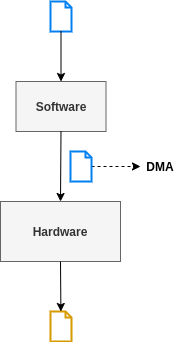
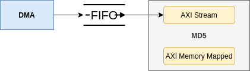
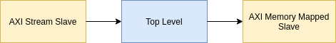
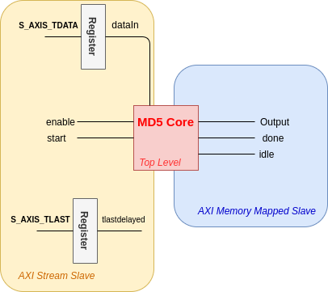
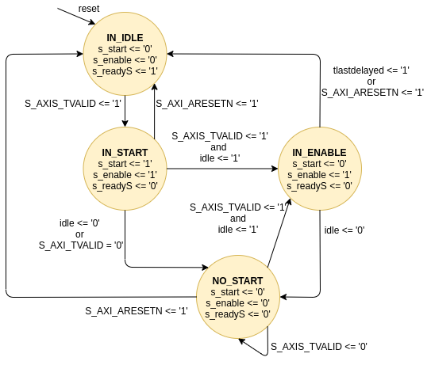
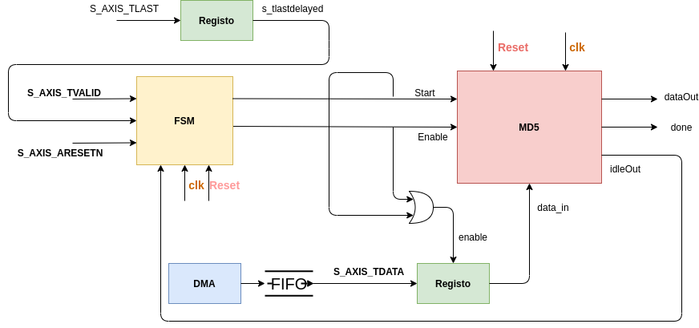

##  MD5 Cryptographic Hash Function - Hardware and Software

The main idea of this project is to implement a system where:

- The most complexity part is implemented on hardware (MD5 hash function)
- The interaction is implemented on software

To explore the complexity and to compare two approaches:

We developer a script to implement MD5 in C and compare the performance of three approaches:

- All on software
- All on hardware
- MD5 on hardware and interaction on software

The implementation will be based on this paper: [Hardware implementation of the MD5 algorithm](https://www.sciencedirect.com/science/article/pii/S1474667016324429).

The system has a DMA module to data transfers.

## Requirements

- Vivado 2019.2
- Vitis 
- Nexys4 Digilent Xilinx (FPGA)

## Implementation

1. On Vivado was implemented a version just on hardware with an IP Core to MD5.
2. Then, it was implemented a version with IP Core on hardware to implement MD5 and all the control on software. Input data came from software to hardware by DMA and all the process occurs on hardware. When the process finishes, the data produced on hardware is transmitted by AXI Memmory Mapped Interface to software to show the user.

3. Finish, the last version just on software was implemented (simple script).
4. It was counted the time on different approaches and compare results.

## Hardware + Software

The IP Core to implement the MD5 function has a AXI Stream Slave interface and a AXI Memmory Mapped Interface. The follow images show the interaction:

On the AXI Stream Slave interface we have the following state machine:

## Architecture

## Authors

* **Catarina Silva** - [catarinaacsilva](https://github.com/catarinaacsilva)

## License

This project is licensed under the MIT License - see the [LICENSE](LICENSE) file for details